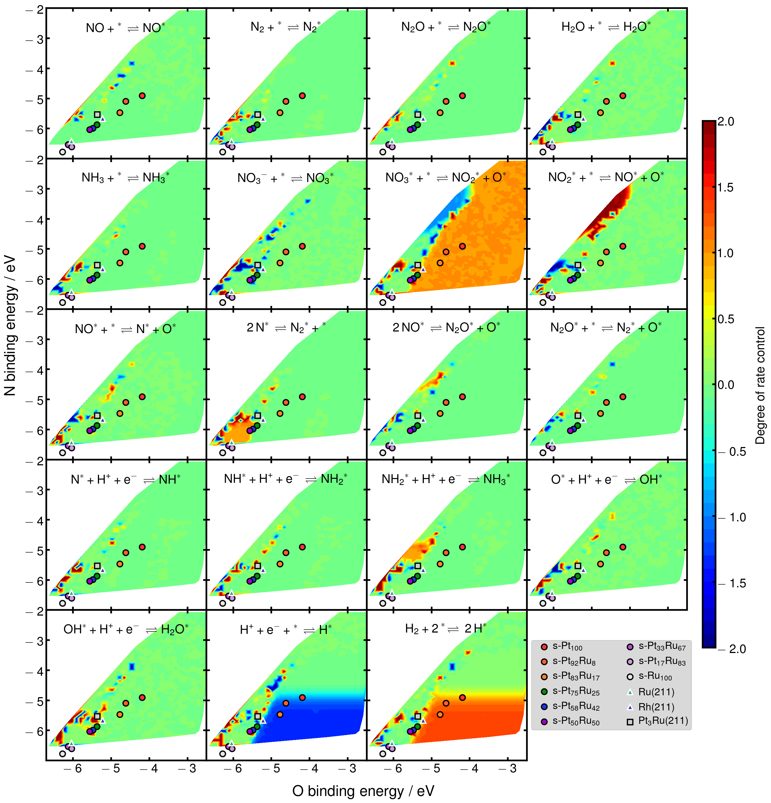
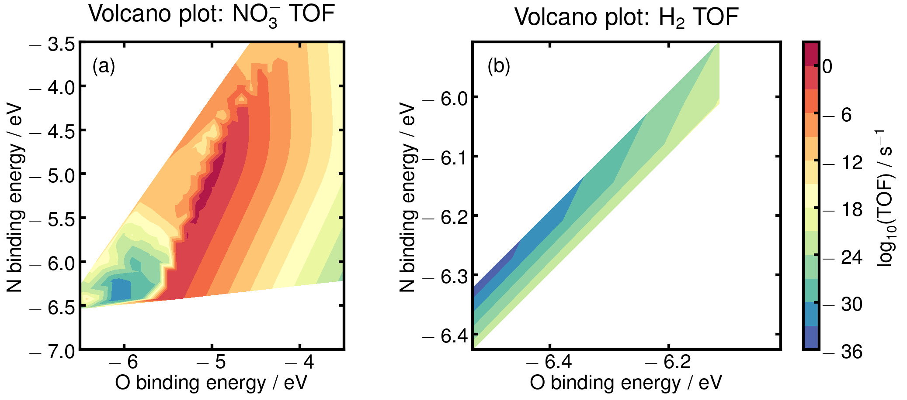

# Rerunning NO<sub>3</sub>RR microkinetic simulations

## Introduction

- For our PtRu manuscript, we desired to include a degree-of-rate-control (DRC) plot in order to bolster our argument for why Pt<sub>75</sub>Ru<sub>25</sub>/C is experimentally observed to yield the highest NO3RR activity.
- [Our previous work](https://pubs.acs.org/doi/abs/10.1021/acscatal.9b02179) ran these microkinetics simulations at 0.1 V vs. RHE but did not include DRC results. We reran these calculations at 0.1 V vs. RHE with similar inputs and with DRC analysis turned on.

## Programming environment

For reproducibility, here is a description of the tools and environment used to run the simulations.

- Calculations were performed on [KNL nodes](https://docs.nersc.gov/systems/cori/#knl-compute-nodes) of the the Cori supercomputer at the [National Energy Renewable Science Computing Center (NERSC)](https://www.nersc.gov/).
- To run Docker images on NERSC, the [Shifter tool](https://docs.nersc.gov/development/shifter/how-to-use/) was used. Shifter allows one to run programs inside Docker images without having to specify volume mapping options to access the local file system.
- Version 2.7.0 of the [MKMCXX microkinetic modeling software package](https://mkmcxx.nl/) was used for all calculations. This version is no longer available at the author's website, but is available as a [Docker image through Docker Hub](https://hub.docker.com/r/samueldy/mkmcxx/tags).
- [GNU Parallel](https://www.gnu.org/software/parallel/) 20190222 was used to parallelize individual microkinetic simulations. Its usage is shown in the code below.
- The [Conda](https://www.anaconda.com/) environment used in the [Jupyter](https://jupyter.org/) notebook that reads simulation results and produces plots is given in `conda-package-lock.yml`.

## Usage

Do the following while in the `0.1V-vs-RHE` directory and with Python 2.7 accessible from the path as `/usr/bin/python`:

``` bash
# Generate base simulation files
bash ./generate.sh

# Create run commands for just those simulations where
# all surface activation barriers are positive
/path/to/python2.7 ./get1_rate.py

# Execute the simulations
bash ./runTask-cori-knl.slurm

# Or, if on a Slurm cluster:
sbatch runTask-cori-knl.slurm
```

## Explanation of code

- The file `input.mkm` is a template for the input file for a single MKMCXX microkinetics simulation. Its syntax is demonstrated through an introductory tutorial [here](https://wiki.mkmcxx.nl/index.php/My_first_simulation), as well as a series of example files included in the program download. Various options for the simulation are documented [here](https://wiki.mkmcxx.nl/index.php/Keywords_and_settings). 
    - In our code, `input.mkm` contains all of the parameters necessary to predict the NO<sub>3</sub>RR turnover frequency and product selectivities for a single set of N and O binding energies, at a given potential.
    - These parameters include the Hertz-Knudsen adsorption energies for adsorption/desorption of species to/from the surface (given in the lines labeled `HK;`) as well as forward and backward Arrhenius barriers for surface reactions and some adsorption/desorption reactions (given in the lines labeled `AR;`).
- The file `Geninput.py` implements the linear adsorbate and BEP scaling relationships. It takes in N and O binding energies (read through standard input) as well as an applied potential (hard-coded in the `Potential = 0.1 * 96.485` line). The convention for this simulation is that binding energies are in kJ/mol and that more *positive* binding energies indicate stronger adsorption. To change the applied potential to something other than 0.1 V vs. RHE, you should do a global search-and-replace operation on all files in this folder to replace `Potential = 0.1 * ...` with `Potential = <new potential> * ...`. Through arithmetic and string substitution, this Python program takes a single set of N and O binding energies (and the applied potential) and produces a single MKMCXX input file with the correct Hertz-Knudsen and Arrhenius parameters for those binding energies and potential.
- The file `generate.sh` establishes a grid of N and O binding energies ranging from 200 kJ/mol to 700 kJ/mol in both variables. It then calls `Geninput.py` for each pair of N and O binding energies and places the generated MKMCXX input file into its own directory. GNU Parallel is employed here to accelerate the generation of these ~2k folders.
- The file `get1_rate.py` (which also contains the hard-coded applied potential) writes out commands to execute each one of the simulations. (This list of commands makes it easier to execute simulation jobs in parallel later on.) However, it writes out commands only for those simulations for which the specified N and O binding energy cause the Arrhenius barriers of all the surface reactions to be positive. It does this by hard-coding the BEP relationships for these reactions. With adsorbate scaling and BEP relations, it is possible to specify pairs of N and O binding energies that lead to unphysical, negative reaction barriers. This file ensures that those points are not considered for simulation.
- The file `worker.sh` is the program that is ultimately executed once per simulation. It reads from standard input the name of the folder whose simulation is to be run, checks to ensure that MKMCXX has not already completed work in this folder, and then executes MKMCXX via the Docker image.
- The file `runTask-cori-knl.slurm` is a Slurm submission script specific to the Cori supercomputer at NERSC, but could be adapted for a generic computing cluster environment. This script loads GNU parallel and executes it on the command list `commands.txt` which was generated by `get1_rate.py`. All simulations used KNL nodes on Cori, which have 68 physical cores and 4 hardware hyperthreads per core. The `input.mkm` template uses the `NPAR=4` setting to instruct each MKMCXX instance to use 4 hyperthreads, and we run up to 66 such processes at any time. The outcomes of these jobs and their completion status is recorded to a `joblog` file in the submission directory, so that GNU Parallel can be quit and restarted at any time without repeating completed jobs. This enables us to set a low minimum wall time on Cori, enabling faster job turnaround and cheaper job cost through use of the [flex discount](https://docs.nersc.gov/jobs/policy/#flex).

## Results

- A Jupyter notebook (`01-jul-2020_ptru-kinetics-plots.ipynb`) is used to parse and read results and produce DRC and TOF plots based on microkinetics data. This notebook makes heavy use of the `mkmcxx` Python module, which is included.
- The usage of this module to process results and produce plots appears below.

### Degree of rate control plot

- Here is the generated degree of rate control plot:



### Turnover frequency plot

- Here is the generated turnover frequency plot:


